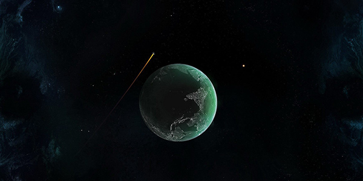

#KinSlideshow

兼容IE6/IE7/IE8/IE9,FireFox,Chrome*,Opera的 jQuery. KinSlideshow幻灯片插件，功能很多 ，基本能满足你在网页上使用幻灯片(焦点图)效果。


##使用方法

* 焦点图显示的标题为 img 中 alt 属性中的文字

* 当只有一张图片时不显示按钮，但也会有无缝切换效果

* 代码

```javascript
javascript:

  $(function(){
      $("#KinSlideshow").KinSlideshow({
                moveStyle:"right",
                titleBar:{
                  titleBar_height:30,
                  titleBar_bgColor:"#08355c",
                  titleBar_alpha:0.5
                },
                titleFont:{
                  TitleFont_size:12,
                  TitleFont_color:"#FFFFFF",
                  TitleFont_weight:"normal"
                },
                btn:{
                  btn_bgColor:"#FFFFFF",
                  btn_bgHoverColor:"#1072aa",
                  btn_fontColor:"#000000",
                  btn_fontHoverColor:"#FFFFFF",
                  btn_borderColor:"#cccccc",
                  btn_borderHoverColor:"#1188c0",
                  btn_borderWidth:1
                }
        });
  })

```

``` HTML
HTML:

  <div id="KinSlideshow" style="visibility:hidden;">
      <a href="#" target="_blank"></a>
      <a href="#" target="_blank"></a>
      <a href="#" target="_blank"></a>
      <a href="#" target="_blank"></a>
      <a href="#" target="_blank"></a>
      <a href="#" target="_blank"></a>
  </div>
```


* 参数列表

``` javascript

//设置间隔时间为5秒 【单位：秒】 [默认为5秒]
intervalTime:5,   

//切换一张图片所需时间，【单位：毫秒】[默认为400毫秒]
moveSpeedTime:400,

//切换方向 可选值：【 left | right | up | down 】left:向左切换,right:向右切换,up:向上切换,down:向下切换 [默认向左切换]
moveStyle:"left",

//鼠标操作按钮事件,可选值：【mouseclick | mouseover】mouseclick：鼠标单击切换。mouseover：鼠标滑过切换。[默认为鼠标点击按钮切换]
mouseEvent:"mouseclick",

//是否显示标题背景 可选值：【 true | false 】[默认为true]
isHasTitleBar:true,		   

titleBar:{
  titleBar_height:40,//标题背景高度。[默认：40]
  titleBar_bgColor:"#000000",//标题背景颜色。[默认：#000000]
  titleBar_alpha:0.5//标题背景透明度，取值【0~1】。[默认：0.5]
},//标题背景样式，(isHasTitleBar = true 前提下启用)

isHasTitleFont:true,	//是否显示标题文字 可选值：【 true | false 】[默认为true]

titleFont:{
  TitleFont_size:12, //标题文字大小 单位像素。[默认：12]
  TitleFont_color:"#FFFFFF", // 标题文字颜色。[默认：#000000]
  TitleFont_family:"Verdana",//标题文字字体。[默认：Verdana]
  TitleFont_weight:"bold" //标题文字粗细。可选值：【 bold | normal 】[默认："bold"]  ,normal 正常 不加粗。
}, //标题文字样式，(isHasTitleFont = true 前提下启用)

isHasBtn:true, //是否显示按钮

btn:{
  btn_bgColor:"#666666", //按钮背景颜色  [默认："#666666"]。
  btn_bgHoverColor:"#CC0000",//按钮滑过/点击 背景颜色  [默认："#CC0000"]。
  btn_fontColor:"#CCCCCC",//按钮文字颜色  [默认："#CCCCCC"]。
  btn_fontHoverColor:"#000000",//按钮滑过/点击 按钮文字颜色  [默认："#000000"]。
  btn_fontFamily:"Verdana",//按钮文字字体  [默认："Verdana"]。
  btn_borderColor:"#999999", //按钮边框颜色  [默认："#999999"]。
  btn_borderHoverColor:"#FF0000",//按钮滑过/点击 按钮边框颜色  [默认："#FF0000"]。
  btn_borderWidth:1,//按钮边框宽度，单位像素 不能超过3  [默认：1]。
  btn_bgAlpha:0.7 //按钮透明度 ，取值【0~1】 [默认：0.7]。
} //按钮样式设置，(isHasBtn = true 前提下启用)

```


* 【多项复合】参数调用说明

```
  $(function(){
      $("#KinSlideshow").KinSlideshow({
              //设置标题文字大小为14px，颜色：#FF0000 【titleFont 其他未设置的 使用默认参数设置】
              titleFont:{
                TitleFont_size:14,
                TitleFont_color:"#FF0000"
                }
      });
  })

```


* 小提示1:

> 外层div建议加上一句样式：```style="visibility:hidden;"```

> 不加此句在IE下页面刚加载的瞬间时候会看到所有图片原始样子

> 这是因为KinSlideshow 要等页面加载完成才能解析页面中要设置成焦点图的HTML

> 虽然只有不到0.01秒的瞬间但用户体验不太好，所以建议加上。不加对程序也没影响！

* 小提示2:

> 想要兼容Chrome需要在img标签中写上图片的实际宽度和高度``````,其他浏览器不需要，直接``````


* 小提示3：

> 如果moveStyle是「right」或者「left」，则html必须必须这样写，这种写法是正确的：

```
<a href="#" target="_blank"></a>
```

> 如果这样写，还有换行，那么会出现空格现象，所以在做的过程中，请注意代码格式化

```
<a href="#" target="_blank">
    
</a>
```
> 上边这种写法是错的。
